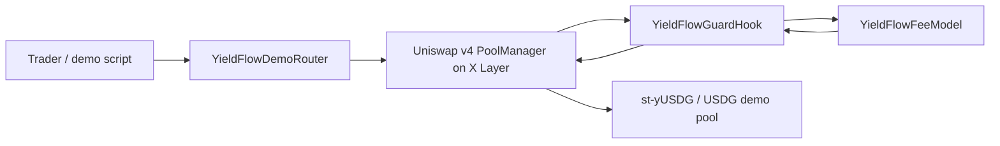

# YieldFlow Guard Submission Kit

This document is the public-facing hackathon submission pack for YieldFlow Guard.

## Submission Snapshot

| Field | Value |
| --- | --- |
| Project name | YieldFlow Guard |
| One-liner | A Uniswap v4 Hook that dynamically prices exit pressure for static yield-position pools on X Layer. |
| Category fit | DeFi Hook, dynamic fee, yield asset liquidity |
| Network | X Layer mainnet, chain ID `196` |
| Hook address | `0x7B8Ae07b6eeC3a82109644501E45837559Db54c0` |
| Demo pool ID | `0x19fcbf9649578188e26718f7c88010beed42a1b9bafe6a5c7780947a34943955` |
| Demo pair | `st-yUSDG / USDG` mock static yield-position pool |
| Core proof | Three real swaps triggered dynamic fees: `500 -> 3000 -> 100` |
| Final hook state | `netExitPressure=110e18`, `lastFee=100`, `lastUpdatedBlock=61009807` |

## Why This Can Win

| Judging axis | YieldFlow Guard angle |
| --- | --- |
| Innovation | Uses v4 dynamic fee override as a flow-sensitive risk price, not a static fee tier. The Hook turns exit pressure into an on-chain fee signal. |
| Market potential | X Layer yield assets need safer exit liquidity. LPs can quote a higher fee when users crowd into exits and a lower fee when order flow helps rebalance the pool. |
| Completion | Hook, demo tokens, demo router, v4 pool, liquidity, and three behavior-triggering swaps are all deployed and verifiable on X Layer. |
| Demo bonus | The mechanism is easy to show visually: base fee, worsening exit fee, then rebalancing fee. |

## Core Pitch

Yield assets need liquidity, but early LPs need protection when redemptions become one-sided. YieldFlow Guard is a Uniswap v4 Hook for static yield-position pools on X Layer. It observes swap direction, updates net exit pressure, and overrides the LP fee: normal exit flow pays the base fee, concentrated exit pressure pays more, and rebalancing flow gets a lower fee. This gives LPs a transparent on-chain compensation mechanism while keeping the UX simple for routers and wallets.

## Architecture

## Hook Mechanism

| Step | Hook behavior | Demo evidence |
| --- | --- | --- |
| Pool setup | Owner configures whether the yield token is `currency0` or `currency1`. | `poolConfigs(poolId) = (true, false)` |
| Add liquidity | `afterAddLiquidity` emits observed yield/base deltas. | PoolManager holds both initial tokens. |
| Before swap | `beforeSwap` quotes the current dynamic fee from net exit pressure. | `FeeQuoted` events show `500`, `3000`, `100`. |
| After swap | `afterSwap` records new net exit pressure. | Final state is `110e18`. |

## On-Chain Evidence

Official explorer base from X Layer docs: `https://www.okx.com/web3/explorer/xlayer`.
Use the address or transaction hash in the explorer search box.

| Evidence | Hash / Address | Notes |
| --- | --- | --- |
| Hook contract | `0x7B8Ae07b6eeC3a82109644501E45837559Db54c0` | Owner verified as deployer. |
| Hook deployment tx | `0x0e92e30b22b0c11eca88fbf4134697652a60532833c3dac30b13d6b0cdaacd34` | Block `61009042`. |
| Demo router | `0xf166b45373b5c4D133fF5812331b8d870944C91f` | Minimal router for initialize, liquidity, and swap proofs. |
| USDG mock | `0x61fA26D5b898088D007F4B807934e00Ba368030B` | Demo base token. |
| st-yUSDG mock | `0x9E3d360125Bc17Af083200F2FF398F1dC6fEBBF7` | Demo static yield-position token. |
| Demo pool ID | `0x19fcbf9649578188e26718f7c88010beed42a1b9bafe6a5c7780947a34943955` | Dynamic-fee v4 pool using the Hook. |
| Pool configuration | `0x5e2556594d89bc9b129299c8e05fc62f9c92f512e8d7fb04c509ae5612a981f8` | Configures yield token side. |
| Pool initialization | `0xb2f3c2cdb0c828d7fbde81ee600c005f8eddfd628eaceceb0447d005f5835446` | Initializes at 1:1. |
| Add liquidity | `0x87be387f265708cea59302fc1c26a3343262f4e0ba5591b0192720f9508bf113` | Full-range initial liquidity. |
| Balanced exit swap | `0xaa0092fb40d120369f2169bcca345e5c6116a3ac28024b9edf9c0711260689bf` | Fee quoted `500`; pressure becomes `10e18`. |
| Worsening exit swap | `0x356d9ae6bde524d614b784d648a24541db043eeac8f1b4d99aef2c3a05b9c762` | Fee quoted `3000`; pressure becomes `130e18`. |
| Rebalancing swap | `0x6d7cd050adc2260487069074a70cefe63acd8747ef1ed668b0cd48f894289619` | Fee quoted `100`; final pressure becomes `110e18`. |

## Demo Video Script

Target length: 90-120 seconds.

The web-video artifact lives in `submission/video/index.html`. The narration source is `submission/video/script.md`, the scene outline is `submission/video/outline.md`, and the recording helper is `submission/video/record.js`.

| Time | Visual | Voiceover |
| --- | --- | --- |
| 0:00-0:15 | Project title, X Layer and Uniswap v4 Hook | "YieldFlow Guard prices exit pressure for static yield-position pools on X Layer." |
| 0:15-0:35 | Diagram of trader, PoolManager, Hook, fee model | "When users exit a yield token into the base token, LP risk increases. The Hook turns that pressure into a transparent dynamic fee." |
| 0:35-0:55 | README target table and deployed Hook address | "The Hook and v4 demo pool are deployed on X Layer mainnet, with verifiable addresses and transactions." |
| 0:55-1:20 | Three swap evidence rows | "The first exit swap uses the base fee, the larger worsening exit raises the fee, and a rebalancing swap lowers it." |
| 1:20-1:40 | Final `flowStates` output | "After the sequence, the Hook stores net exit pressure on-chain. The final fee is the minimum fee because the last trade helped rebalance the pool." |
| 1:40-2:00 | Market slide | "The same pattern can support X Layer yield assets and static wrappers, giving LPs a safer way to bootstrap liquidity." |

## Short Form Submission Answers

### Project description

YieldFlow Guard is a Uniswap v4 Hook that dynamically adjusts LP fees for static yield-position pools on X Layer. It tracks whether swaps increase or reduce exit pressure, then quotes a higher fee for one-sided exits and a lower fee for rebalancing flow. The deployed demo uses a `st-yUSDG / USDG` pool, records pressure on-chain, and shows three real swaps producing fees of `500`, `3000`, and `100`.

### Innovation

Most AMMs treat LP fee tiers as static configuration. YieldFlow Guard makes the fee a stateful risk signal. The Hook uses `beforeSwap` to quote a fee from current exit pressure and `afterSwap` to update pressure after each trade. This creates a new market structure for yield assets: LP compensation responds to redemption pressure without requiring users to understand a separate risk model.

### Market potential

X Layer can attract yield assets, stable assets, and wrappers that need reliable exit liquidity. Early pools often suffer from shallow liquidity and one-sided flow. YieldFlow Guard gives LPs a clear reason to provide liquidity because the pool pays more when exit demand concentrates and less when trades rebalance inventory. The P0 demo uses mock static tokens; the P1 path is integrating real static wrappers once the target assets are confirmed on X Layer.

### Completion

The project is fully demonstrable on X Layer mainnet. It includes a deployed Hook, deployed demo tokens, a demo router, a configured v4 pool, initial liquidity, and three real swaps that trigger different Hook fee paths. The repository includes tests, deployment scripts, on-chain evidence, and a reproducible demo command sequence.

## X Post Draft

Before publishing, attach all three posters and add the public GitHub repository URL. The post must include `@XLayerOfficial` and `#BuildX` for the Google Form. The final X post pack is in `submission/social/x-thread.md`; X poster prompts are in `submission/social/prompts/` and should be generated as 9:16 GPT Image 2 images at `1152x2048`.

### Single Post

YieldFlow Guard: v4 Hook on X Layer for yield-position exit pools.

Exit pressure raises LP fees; rebalancing gets lower fees. Live Hook + pool + swaps: 500 -> 3000 -> 100.

Repo: `https://github.com/MaxxxDong/yieldflow-guard`

@XLayerOfficial @Uniswap @flapdotsh #BuildX

## Final Submission Checklist

- [x] Hook logic built around Uniswap v4 Hooks.
- [x] Hook deployed on X Layer mainnet.
- [x] v4 pool configured and initialized on X Layer.
- [x] Hook behavior triggered by real on-chain transactions.
- [x] README contains contract addresses, pool ID, and transaction hashes.
- [x] Submission kit prepared.
- [ ] Public repository URL ready.
- [ ] Demo video recorded and uploaded.
- [ ] Dedicated X account post published.
- [ ] Google Form submitted before `2026-05-28 23:59 UTC`.

## Submission Operator Plan

Use `docs/submission-plan.md` as the concrete operator checklist. It includes the exact Google Form field pack, X post attachment mapping, and recording commands.

## Sources

- OKX Hook the Future hackathon page: https://web3.okx.com/xlayer/build-x-hackathon/hook
- X Layer network information: https://web3.okx.com/xlayer/docs/developer/build-on-xlayer/network-information
- Uniswap v4 dynamic fees: https://developers.uniswap.org/docs/protocols/v4/concepts/dynamic-fees
- Uniswap v4 hook deployment: https://developers.uniswap.org/docs/protocols/v4/guides/hooks/hook-deployment
